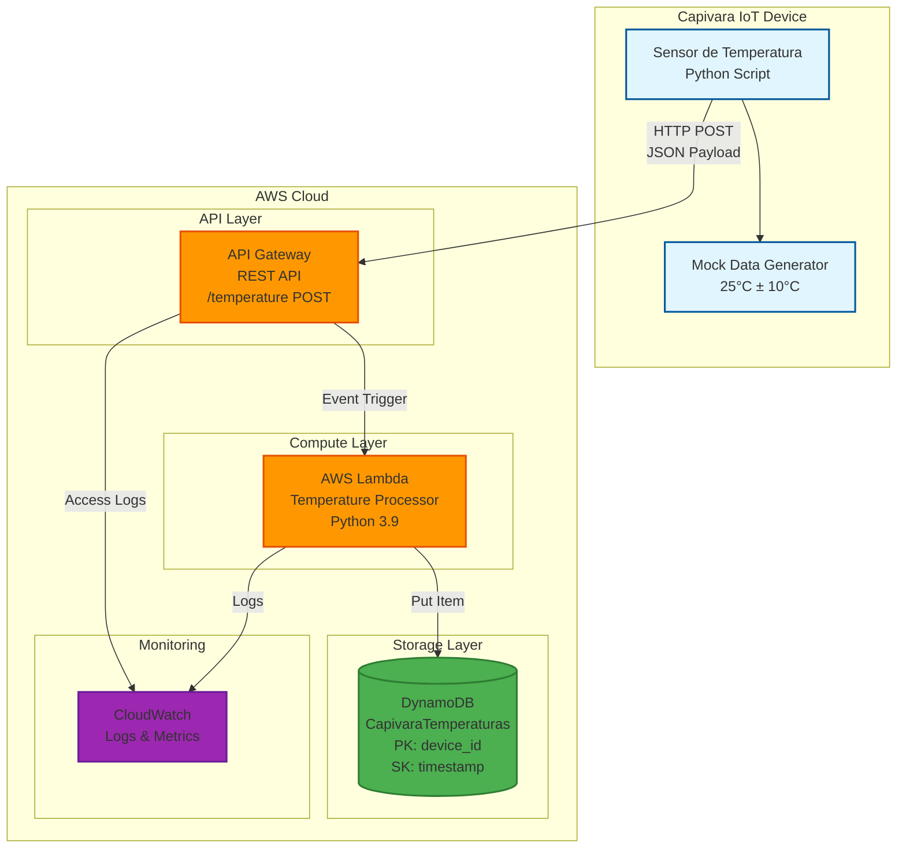
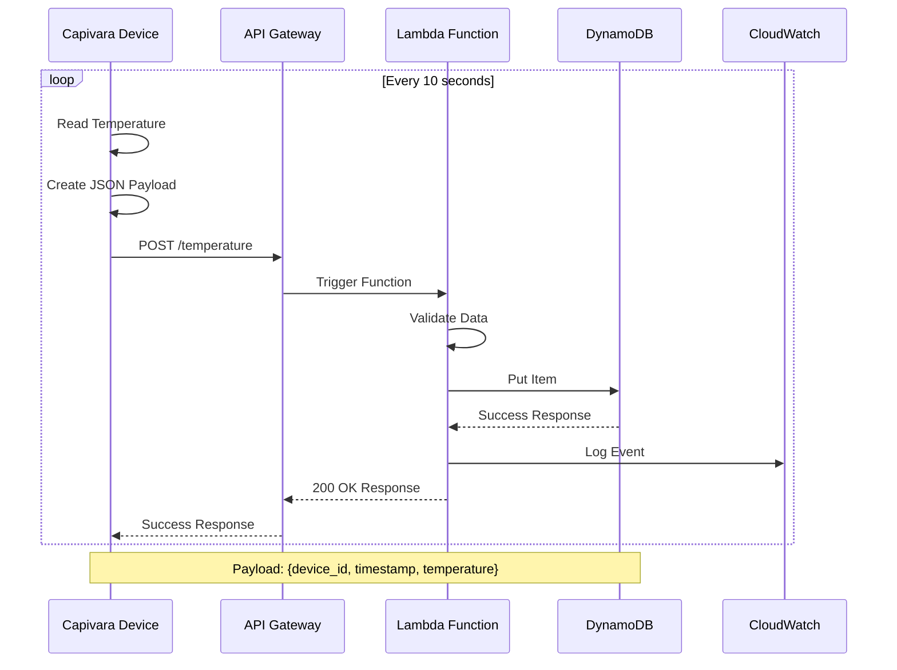

# Diagrama de Arquitetura - Capivara IoT

## Arquitetura do Sistema



## Fluxo de Dados



## Estrutura de Dados

```mermaid
erDiagram
    CapivaraTemperaturas {
        string device_id PK "Partition Key"
        string timestamp SK "Sort Key"
        number temperature "Temperature in Celsius"
        string created_at "ISO timestamp"
        number ttl "Time to Live (30 days)"
    }
    
    Device ||--o{ CapivaraTemperaturas : sends
```

## Componentes AWS

| Componente | Tipo | Configuração |
|------------|------|--------------|
| API Gateway | REST API | CORS habilitado, POST /temperature |
| Lambda | Function | Python 3.9, 30s timeout, DynamoDB permissions |
| DynamoDB | Table | Pay-per-request, Stream habilitado |
| CloudWatch | Logs/Metrics | Retention 14 dias |

## Estimativa de Custos (Região us-east-1)

### Cenário: 1 dispositivo, 1 leitura/10s = 8.640 requests/dia

| Serviço | Uso Mensal | Custo Estimado |
|---------|------------|----------------|
| API Gateway | 259.200 requests | $0.26 |
| Lambda | 259.200 invocações, 128MB, 100ms avg | $0.05 |
| DynamoDB | 259.200 writes, 1KB avg | $0.32 |
| CloudWatch | Logs básicos | $0.10 |
| **Total** | | **~$0.73/mês** |

### Cenário: 100 dispositivos

| Serviço | Uso Mensal | Custo Estimado |
|---------|------------|----------------|
| API Gateway | 25.920.000 requests | $25.92 |
| Lambda | 25.920.000 invocações | $5.18 |
| DynamoDB | 25.920.000 writes | $32.40 |
| CloudWatch | Logs e métricas | $10.00 |
| **Total** | | **~$73.50/mês** |